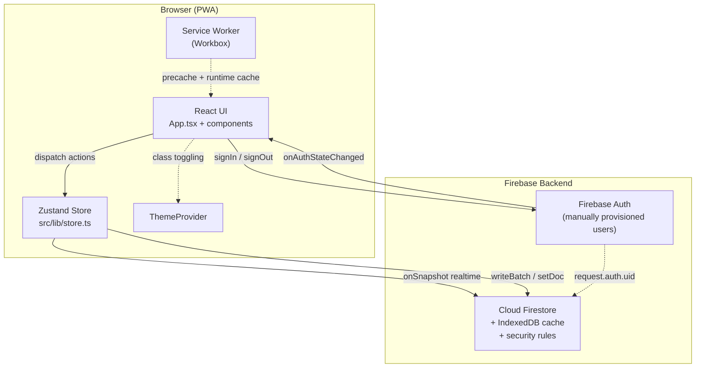
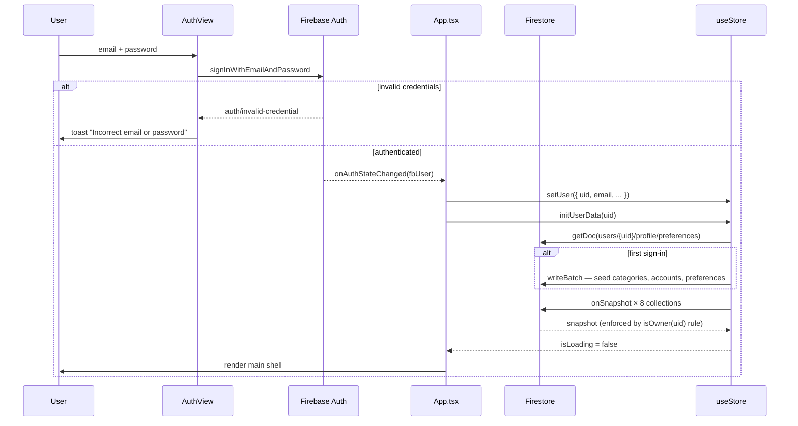
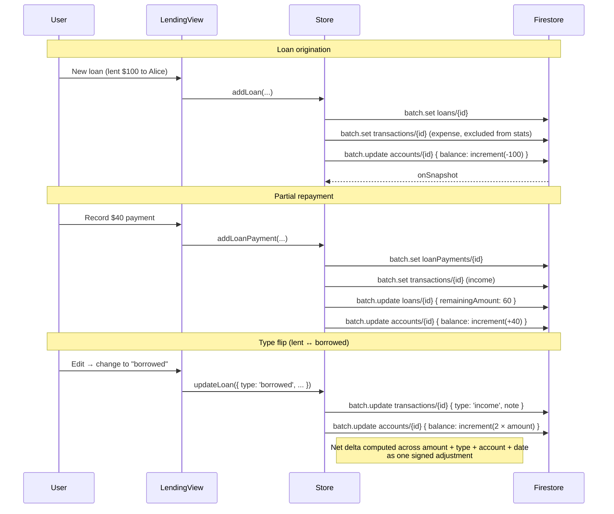
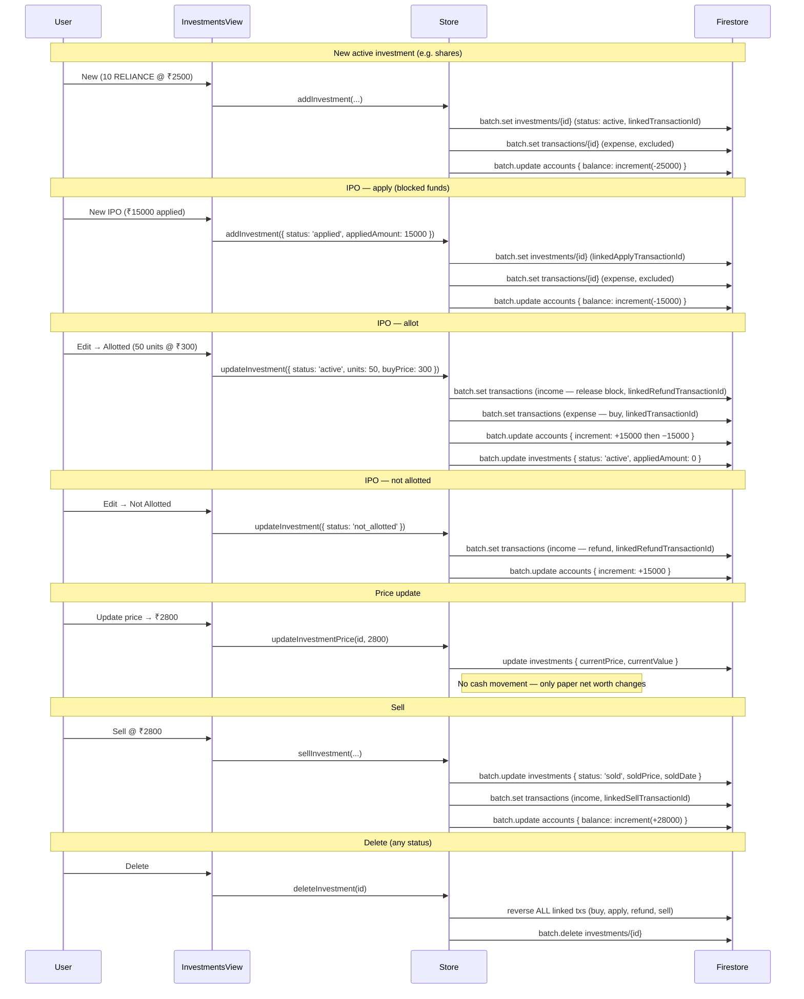
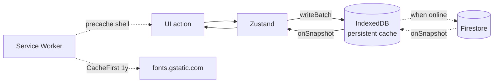
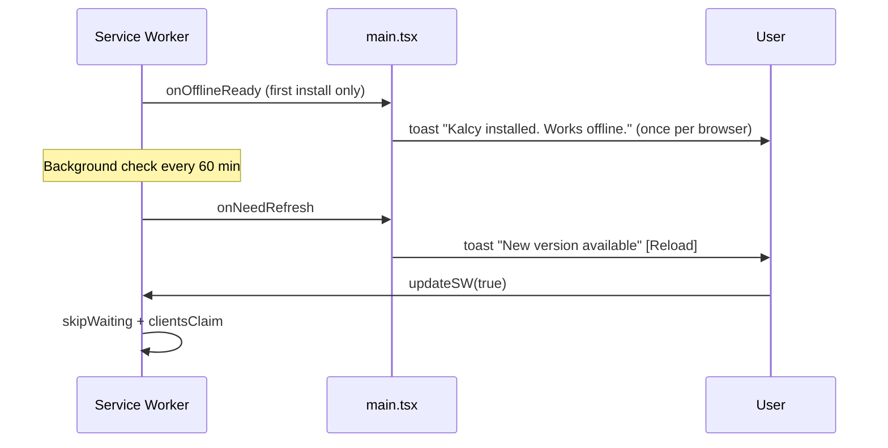
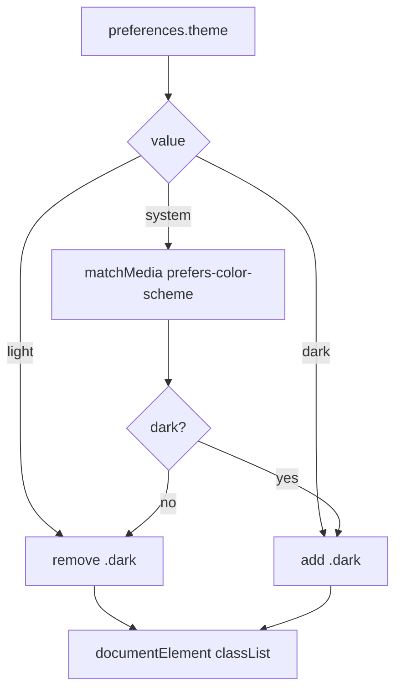

# Kalcy 💰

[](LICENSE)
[](http://makeapullrequest.com)

> A privacy-first, offline-capable personal finance PWA — track expenses, manage budgets, monitor accounts, track loans, and monitor your investment portfolio — all synced in real time through Firebase.

---

## Table of Contents

1. [Overview](#overview)
2. [Tech Stack](#tech-stack)
3. [Features](#features)
4. [High-Level Architecture](#high-level-architecture)
5. [Data Model](#data-model)
6. [Directory Structure](#directory-structure)
7. [Getting Started](#getting-started)
8. [Firestore Setup & Security Rules](#firestore-setup--security-rules)
9. [Core Workflows](#core-workflows)
10. [State Management](#state-management)
11. [Design System](#design-system)
12. [PWA & Offline Strategy](#pwa--offline-strategy)
13. [Scripts](#scripts)
14. [Testing](#testing)
15. [Conventions & Notes](#conventions--notes)
16. [Known Limitations](#known-limitations)
17. [License](#license)

---

## Overview

**Kalcy** is a mobile-first, Progressive Web App (PWA) for personal finance. It is intentionally **invite-only in the sense that there is no sign-up UI** — user accounts are provisioned manually in Firebase Console → Authentication. Once signed in, all data is scoped to `users/{uid}/…` in Firestore and enforced by security rules (`isOwner(uid)`), so one user can never read or write another user's data.

It is built as a single-page React app that:

- Syncs all data to **Cloud Firestore** with **offline persistence enabled by default**
- Seeds sensible defaults (accounts, categories, preferences) on first sign-in
- Handles **accounts, transactions, transfers, budgets, loans, and repayments** with correct double-entry-style balance updates
- Tracks an **investment portfolio** (shares, IPOs, mutual funds, ETFs, crypto, bonds, FDs, real estate, gold) with live P&L and net-worth integration
- Works **fully offline** once installed, and auto-updates in the background
- Ships as an installable PWA with maskable icons and a themed splash

The project deliberately avoids a backend server: Firestore + Firebase Auth are the entire "backend", and all business logic lives in a Zustand store that reconciles local state with real-time Firestore snapshots.

---

## Tech Stack

| Layer | Choice | Notes |
|---|---|---|
| Build | **Vite 5** | Fast HMR, ESM-native, `@` → `src` alias |
| UI | **React 18** + **TypeScript 5** | Strict mode, `noUnusedLocals`, `noUnusedParameters` |
| Styling | **Tailwind CSS 3** + **shadcn/ui** (Radix) | CSS-variable theming, light/dark |
| Animation | **Framer Motion 11** | Layout pills, sheet transitions, swipe gestures |
| State | **Zustand 4** (+ `useShallow`) | Single store, no boilerplate |
| Backend | **Firebase 10** (Auth + Firestore) | `persistentLocalCache`, `persistentMultipleTabManager` |
| Charts | **Recharts 2** | Pie, Bar, Line |
| Bottom sheets | **Vaul** | iOS-style drawers, `repositionInputs` for keyboard |
| Toasts | **Sonner** | Themed via `ThemeProvider` |
| Icons | **Lucide React** | Mapped by string name in `icon-map.tsx` |
| PWA | **vite-plugin-pwa** + **Workbox 7** | `autoUpdate`, runtime font caching, precache |
| Assets | **@vite-pwa/assets-generator** | Generates maskable/apple icons from `kalcy-logo.svg` |
| Tests | **Playwright** + **pytest** | End-to-end against the live deployment |

---

## Features

### 🔐 Authentication & Access Control

- Email/password sign-in via Firebase Auth
- **No public sign-up.** Users are created manually in **Firebase Console → Authentication → Users**; anyone without a Firebase Auth account cannot sign in.
- **Firestore security rules** enforce strict per-user isolation via `request.auth.uid == uid`; the catch-all `match /{document=**}` denies everything else.
- Profile drawer for display name + password change (requires re-authentication).
- If Firestore ever returns `permission-denied` (e.g. a stale token, a misconfigured rule, or a deleted Auth user), the store's listener error handler **signs the user out immediately** and surfaces a toast.

### 💸 Transactions

- Three types: **expense**, **income**, **transfer**
- Built-in **calculator numpad** (supports `+ − × ÷`, AC, backspace; left-to-right evaluation matching iOS Calculator)
- Hierarchical categories (parent → sub-categories)
- Date + time picker with quick presets (Today / Yesterday / 2 days ago)
- Notes, "exclude from stats", "exclude from budget" switches
- Swipe left to delete, swipe right to edit
- Four view modes: **Daily**, **Calendar**, **Monthly**, **Summary**
- Transactions linked to a loan or investment are **delete-guarded** in the list — deleting one would leave the parent record inconsistent, so the UI redirects you to the Loans / Investments tab instead

### 🏦 Accounts

- Types: cash, bank, card, savings, wallet
- Editable icon (Lucide) + color
- Toggle "include in net worth total"
- **Transfers** between accounts
- Editing an account's *initial* balance shifts its live balance by the same delta (preserving all transactional drift)
- Deleting an account **cascades** — removes every linked transaction, loan, loan payment, and investment, and reverses each transaction's effect on the surviving accounts

### 🎯 Budgets

- Monthly budgets — **overall** or **per category**
- Sub-category roll-up (parent budget includes children)
- Warning (≥80%) and over-budget states
- Carry-over flag (data model ready)
- Duplicate-budget guard (one overall + one per category per month)
- Delete uses the shared `ConfirmDialog` — consistent with every other destructive action

### 🤝 Lending

- Track money **lent** (asset) or **borrowed** (liability)
- Each loan generates a mirrored account transaction automatically
- Partial repayments with payment history
- Auto-settle when `remainingAmount ≤ 0`
- Editing a loan reconciles **amount, type, account, and date** in one atomic delta — switching `lent ↔ borrowed` correctly flips the transaction type and reverses the balance effect
- Net worth = accounts balance + net loan position

### 📈 Investments

- Track **shares, IPOs, mutual funds, ETFs, crypto, bonds, fixed deposits, real estate, gold** and custom types
- Per-unit **buy price** and **current market price** (user-updated)
- Automatic **unrealized P&L** (on active positions) and **realized P&L** (on sold positions)
- Every buy/sell/refund creates a mirrored, stats/budget-excluded account transaction
- Portfolio **allocation breakdown** by asset type
- **Net worth contribution** = market value of all active positions
- **Full IPO lifecycle** — `Applied → (Allotted | Not Allotted)`, and `Allotted → Sold`, each with **correct, reversible cash movements**:

  | Transition | Cash effect | Transactions created |
  |---|---|---|
  | New (applied) | `−appliedAmount` | 1 expense (block) |
  | Applied → Allotted | `+appliedAmount − (units × buyPrice)` | 1 income (release block) + 1 expense (buy) |
  | Applied → Not Allotted | `+appliedAmount` | 1 income (refund) |
  | Active → Sold | `+(soldPrice × units)` | 1 income (proceeds) |

- Deleting an investment **reverses every transaction it ever produced** — buy, apply, refund, and sell — because each is tracked by a dedicated field (`linkedTransactionId`, `linkedApplyTransactionId`, `linkedRefundTransactionId`, `linkedSellTransactionId`). This was a bug in v1 (orphaned refund transactions corrupted the account balance) and is now covered by integration tests.
- Selling requires a **positive sale price**; the store rejects a `$0` sale before writing.

### 📊 Statistics

- Monthly donut chart of category breakdown (expense / income toggle)
- 6-month income vs expense bar chart
- Cash-flow line chart
- Category progress bars with % of total

### ⚙️ Preferences

- 20 fiat currencies with symbol lookup
- Light / Dark / System theme
- Week start day (Mon / Sun)

### ☁️ Data

- **CSV export** of all transactions (formula-injection safe)
- **Delete All Data** (clears everything except the preferences marker so re-seeding doesn't trigger)

---

## High-Level Architecture


```mermaid
graph TD
    subgraph Browser["Browser (PWA)"]
        UI["React UI<br/>App.tsx + components"]
        Store["Zustand Store<br/>src/lib/store.ts"]
        Theme["ThemeProvider"]
        SW["Service Worker<br/>(Workbox)"]
    end

    subgraph Firebase["Firebase Backend"]
        Auth["Firebase Auth<br/>(manually provisioned users)"]
        FS["Cloud Firestore<br/>+ IndexedDB cache<br/>+ security rules"]
    end

    UI -->|dispatch actions| Store
    Store -->|onSnapshot realtime| FS
    Store -->|writeBatch / setDoc| FS
    UI -->|signIn / signOut| Auth
    Auth -->|onAuthStateChanged| UI
    Auth -.->|request.auth.uid| FS
    UI -.->|class toggling| Theme
    SW -.->|precache + runtime cache| UI
```

**Key idea:** the UI never talks to Firestore directly. It dispatches intent to `useStore`, which:

1. Computes side effects locally (e.g. account balance deltas, invested amounts)
2. Commits them in a single atomic `writeBatch`
3. Lets Firestore's real-time listeners push the canonical state back into the store

This means **every UI surface is driven by the store snapshot**, and the store is never optimistically out of sync for longer than a round-trip.

---

## Data Model

All user data is scoped under `users/{uid}/…`. Types live in `src/lib/types.ts`.


```mermaid
erDiagram
    USER ||--o{ ACCOUNT : owns
    USER ||--o{ CATEGORY : owns
    USER ||--o{ TRANSACTION : owns
    USER ||--o{ BUDGET : owns
    USER ||--o{ LOAN : owns
    USER ||--o{ LOAN_PAYMENT : owns
    USER ||--o{ INVESTMENT : owns
    USER ||--|| PREFERENCES : has

    ACCOUNT {
        string id
        string name
        enum   type "cash|bank|card|savings|wallet"
        number balance
        number initialBalance
        string currency
        string icon
        string color
        bool   isIncludedInTotal
        number createdAt
    }

    CATEGORY {
        string id
        string name
        enum   type "expense|income|transfer"
        string icon
        string color
        string parentId "nullable"
        bool   isHidden
        number order
    }

    TRANSACTION {
        string id
        enum   type "expense|income|transfer"
        number amount
        string accountId
        string toAccountId "nullable"
        string categoryId "nullable"
        number date
        string note
        bool   isExcludedFromStats
        bool   isExcludedFromBudget
        string linkedLoanId "nullable"
        string linkedPaymentId "nullable"
    }

    BUDGET {
        string id
        string categoryId "null = overall"
        number amount
        string period "monthly"
        bool   carryOver
        string monthYear "YYYY-MM"
    }

    LOAN {
        string id
        string personName
        enum   type "lent|borrowed"
        number principalAmount
        number remainingAmount
        string accountId
        number date
        number dueDate "nullable"
        bool   isSettled
    }

    LOAN_PAYMENT {
        string id
        string loanId
        number amount
        string accountId
        number date
    }

    INVESTMENT {
        string id
        string name
        string symbol
        enum   type "stocks|ipo|mutual_fund|etf|crypto|bond|fixed_deposit|real_estate|gold|other"
        number units
        number buyPrice
        number currentPrice
        number investedAmount "units * buyPrice"
        number currentValue   "units * currentPrice"
        string accountId
        number date
        number soldDate "nullable"
        number soldPrice "nullable"
        enum   status "applied|active|sold|not_allotted"
        number appliedAmount "blocked amount for IPO, 0 otherwise"
        number listingPrice  "nullable"
        number listingDate   "nullable"
        string linkedTransactionId    "nullable, buy tx"
        string linkedApplyTransactionId "nullable, IPO block tx"
        string linkedRefundTransactionId "nullable, IPO release tx"
        string linkedSellTransactionId  "nullable, sell tx"
    }

    PREFERENCES {
        string currency
        string currencySymbol
        enum   theme "light|dark|system"
        number weekStartDay "0|1"
        number monthlyStartDay
    }
```

### Firestore paths

```
users/{uid}/accounts/{accountId}
users/{uid}/categories/{categoryId}
users/{uid}/transactions/{transactionId}
users/{uid}/budgets/{budgetId}
users/{uid}/loans/{loanId}
users/{uid}/loanPayments/{paymentId}
users/{uid}/investments/{investmentId}
users/{uid}/profile/preferences            ← singleton doc, also used as seed marker
```

### Transaction ↔ Account effects

The helper `txEffects()` in `store.ts` produces the balance deltas for any transaction:

| Type | Effect on `accountId` | Effect on `toAccountId` |
|---|---|---|
| `expense` | `−amount` | — |
| `income` | `+amount` | — |
| `transfer` | `−amount` | `+amount` |

These deltas are always applied with `increment(delta)` inside a `writeBatch`, guaranteeing consistency even under concurrent edits.

Loan and investment transactions are **generated by the store** — they use the same `txEffects` path, so all balance arithmetic stays in one place.

### Investment transaction tracking

Every investment keeps an explicit pointer to each transaction it produced, so that deletion and status transitions can reverse exactly the right cash movements:

| Field | Set when | Reversed on |
|---|---|---|
| `linkedTransactionId` | New active investment, or `applied → active` | `deleteInvestment` |
| `linkedApplyTransactionId` | New IPO in `applied` status | `deleteInvestment` |
| `linkedRefundTransactionId` | `applied → active` or `applied → not_allotted` | `deleteInvestment` |
| `linkedSellTransactionId` | `active → sold` | `deleteInvestment` |

This is what makes `deleteInvestment` idempotent and *net-worth neutral* — every cash movement is precisely undone.

---

## Directory Structure

```
.
├── dev-dist/                       # Dev-mode service worker (generated)
│   ├── sw.js
│   └── workbox-*.js
├── public/
│   ├── kalcy-logo.svg              # Source asset for PWA generation
│   ├── favicon.ico
│   ├── apple-touch-icon-180x180.png
│   ├── maskable-icon-512x512.png
│   ├── pwa-64x64.png
│   ├── pwa-192x192.png
│   └── pwa-512x512.png
├── src/
│   ├── components/
│   │   ├── tabs/
│   │   │   ├── accounts-tab.tsx        # Accounts + Transfers + Lending + Investments segments
│   │   │   ├── budgets-view.tsx        # Monthly budgets CRUD
│   │   │   ├── categories-view.tsx     # Category tree CRUD
│   │   │   ├── lending-view.tsx        # Loans & repayments
│   │   │   ├── investments-view.tsx    # Investment portfolio (shares, IPO, crypto, …)
│   │   │   ├── stats-tab.tsx           # Recharts dashboards
│   │   │   └── transactions-tab.tsx    # Daily/Calendar/Monthly/Summary
│   │   ├── ui/                         # shadcn primitives
│   │   │   ├── button.tsx
│   │   │   ├── confirm-dialog.tsx
│   │   │   ├── dialog.tsx
│   │   │   ├── drawer.tsx              # Vaul wrapper
│   │   │   ├── input.tsx
│   │   │   ├── label.tsx
│   │   │   ├── select.tsx
│   │   │   ├── sonner.tsx
│   │   │   ├── switch.tsx
│   │   │   └── textarea.tsx
│   │   ├── auth-view.tsx               # Sign-in screen
│   │   ├── bottom-nav.tsx              # Tab bar + FAB
│   │   ├── calculator-numpad.tsx       # Arithmetic numpad
│   │   ├── error-boundary.tsx          # Top-level error catcher
│   │   ├── icon-map.tsx                # String → Lucide component registry
│   │   ├── profile-edit-drawer.tsx     # Name + password change
│   │   ├── theme-provider.tsx          # light/dark/system
│   │   ├── transaction-item.tsx        # Swipeable row
│   │   └── transaction-sheet.tsx       # Multi-step add/edit sheet
│   ├── lib/
│   │   ├── currencies.ts               # 20 currencies + format helpers
│   │   ├── finance.ts                  # Pure aggregation/derivation helpers
│   │   ├── firebase.ts                 # App + Auth + Firestore (offline cache)
│   │   ├── seed-data.ts                # Default categories/accounts/budgets
│   │   ├── store.ts                    # Zustand store — the "brain"
│   │   ├── types.ts                    # All TypeScript domain types
│   │   └── utils.ts                    # cn() — clsx + tailwind-merge
│   ├── App.tsx                          # Root shell + auth gate + "More" tab
│   ├── index.css                        # Tailwind layers + theme tokens
│   ├── main.tsx                         # SW registration + render
│   └── vite-env.d.ts                    # Env var + PWA client typings
├── Test/                           # Playwright E2E test suite
│   ├── .env.example                # Template — copy to .env (gitignored)
│   ├── conftest.py                 # Fixtures, helpers, .env loader
│   ├── test_phase1.py              # Core logic — budgets, transactions
│   ├── test_phase2.py              # Investments — IPO lifecycle, net worth
│   ├── test_phase3.py              # UI — mobile viewport, numpad, dialogs
│   └── test_phase4.py              # Production — persistence, reconciliation
├── components.json                 # shadcn CLI config
├── index.html                      # PWA meta, theme-color, manifest hints
├── package.json
├── postcss.config.js
├── pwa-assets.config.ts            # Icon generation preset
├── tailwind.config.ts
├── tsconfig.json
└── vite.config.ts                  # VitePWA manifest + Workbox runtime caching
```

---

## Getting Started

### Prerequisites

- Node.js **18+**
- A Firebase project with **Email/Password** auth enabled
- A **Firestore** database (Native mode)

### 1. Install

```bash
npm install
```

### 2. Configure environment

Create a `.env` file at the repo root:

```env
VITE_FIREBASE_API_KEY=...
VITE_FIREBASE_AUTH_DOMAIN=your-project.firebaseapp.com
VITE_FIREBASE_PROJECT_ID=your-project
VITE_FIREBASE_STORAGE_BUCKET=your-project.appspot.com
VITE_FIREBASE_MESSAGING_SENDER_ID=...
VITE_FIREBASE_APP_ID=...
```

These are consumed by `src/lib/firebase.ts` via `import.meta.env`.

### 3. Create users manually

There is **no sign-up UI**. To let someone use Kalcy:

1. Firebase Console → **Authentication** → **Users** → **Add user**
2. Enter email + password, save.
3. That's it. No allowlist collection, no additional provisioning.

The first time that user signs in, `initUserData` seeds:

- 12 default categories
- 2 default accounts (`Cash Wallet`, `Main Checking`)
- Default preferences doc (`users/{uid}/profile/preferences`) — also used as the "already seeded" marker

If you want to revoke access later, delete the user in Firebase Console → Authentication. The next Firestore read will return `permission-denied`, and the listener error handler signs them out automatically.

### 4. Publish Firestore security rules

Copy the rules from [Firestore Setup & Security Rules](#firestore-setup--security-rules) into **Firestore → Rules → Publish**.

### 5. Run

```bash
npm run dev
```

Open the printed `localhost` URL and sign in with a user you created in step 3.

### 6. Regenerate PWA icons (optional)

```bash
npm run generate-pwa-assets
```

Reads `pwa-assets.config.ts` and produces maskable + apple + standard icons from `public/kalcy-logo.svg`.

---

## Firestore Setup & Security Rules

Kalcy relies entirely on **per-user `uid` scoping**. Every document lives under `users/{uid}/…`, and the ruleset below enforces `request.auth.uid == uid` on every read and write. There is **no `allowlist` collection** — access is controlled purely by whether a Firebase Auth user exists.

**Published rules:**

```javascript
rules_version = '2';
service cloud.firestore {
  match /databases/{database}/documents {

    // Helper: Ensure the user is signed in and only accessing their own data
    function isOwner(uid) {
      return request.auth != null && request.auth.uid == uid;
    }

    // User data - locked to their own UID
    match /users/{uid}/accounts/{id}      { allow read, write: if isOwner(uid); }
    match /users/{uid}/categories/{id}    { allow read, write: if isOwner(uid); }
    match /users/{uid}/transactions/{id}  { allow read, write: if isOwner(uid); }
    match /users/{uid}/budgets/{id}       { allow read, write: if isOwner(uid); }
    match /users/{uid}/loans/{id}         { allow read, write: if isOwner(uid); }
    match /users/{uid}/loanPayments/{id}  { allow read, write: if isOwner(uid); }
    match /users/{uid}/investments/{id}   { allow read, write: if isOwner(uid); }

    match /users/{uid}/profile/{doc} {
      allow read:           if isOwner(uid);
      allow create, update: if isOwner(uid);
      allow delete:         if false;
    }

    // Deny everything else by default
    match /{document=**}{ allow read, write: if false; }
  }
}
```

**Notes:**

- The `profile/preferences` doc is **non-deletable** by design — it doubles as the "user has been seeded" marker. `clearCloudData` resets it to `DEFAULT_PREFERENCES` instead of deleting it, so the seed batch doesn't re-run on the next sign-in.
- If you ever see `permission-denied` on the `preferences` listener at sign-in time, the most likely cause is a stale Auth token — the store signs the user out and shows a toast so they can retry.
- No index requirements beyond what Firestore creates automatically — all per-user queries are simple collection reads.

---

## Core Workflows

### 1. Authentication


```mermaid
sequenceDiagram
    participant U as User
    participant AV as AuthView
    participant FA as Firebase Auth
    participant App as App.tsx
    participant FS as Firestore
    participant S as useStore

    U->>AV: email + password
    AV->>FA: signInWithEmailAndPassword
    alt invalid credentials
        FA-->>AV: auth/invalid-credential
        AV->>U: toast "Incorrect email or password"
    else authenticated
        FA-->>App: onAuthStateChanged(fbUser)
        App->>S: setUser({ uid, email, ... })
        App->>S: initUserData(uid)
        S->>FS: getDoc(users/{uid}/profile/preferences)
        alt first sign-in
            S->>FS: writeBatch — seed categories, accounts, preferences
        end
        S->>FS: onSnapshot × 8 collections
        FS-->>S: snapshot (enforced by isOwner(uid) rule)
        S-->>App: isLoading = false
        App->>U: render main shell
    end
```

**Notes:**

- The gate is **Firebase Auth itself**. Anyone without an Auth user never gets past `signInWithEmailAndPassword`.
- `initUserData` seeds defaults only if `users/{uid}/profile/preferences` is missing, then attaches **eight** `onSnapshot` listeners (accounts, categories, transactions, budgets, loans, loanPayments, **investments**, preferences).
- If the **seed batch fails** (e.g. network drop during first sign-in), a toast surfaces the error rather than leaving the user staring at an empty app.
- Any listener that receives `permission-denied` triggers an immediate `signOut()` + toast. This is the safety net for stale tokens or deleted Auth users.

### 2. Adding a Transaction


```mermaid
flowchart TD
    A[TransactionSheet<br/>numpad + fields] --> B{Validate}
    B -- invalid --> E[toast.error]
    B -- valid --> C[store.addTransaction]
    C --> D[genId + createdAt]
    D --> F[txEffects compute deltas]
    F --> G[writeBatch]
    G --> H[set transaction doc]
    G --> I[increment account balances]
    H & I --> J[batch.commit]
    J --> K[onSnapshot pushes new state]
    K --> L[UI re-renders]
```

`updateTransaction` reverses the **old** effects and applies the **new** ones — the net delta is always committed atomically:

```ts
const net = new Map<string, number>();
oldEffects.forEach((v, k) => net.set(k, (net.get(k) ?? 0) - v));
newEffects.forEach((v, k) => net.set(k, (net.get(k) ?? 0) + v));
```

If the edited transaction is **linked to a loan or investment** (`linkedLoanId`, `linkedPaymentId`, or any of the four investment transaction IDs), `deleteTransaction` dispatches to the parent's delete function instead of deleting the row — keeping the linked entity's balance and remaining amount consistent.

### 3. Loan Lifecycle


```mermaid
sequenceDiagram
    participant U as User
    participant LV as LendingView
    participant S as Store
    participant FS as Firestore

    Note over U,FS: Loan origination
    U->>LV: New loan (lent $100 to Alice)
    LV->>S: addLoan(...)
    S->>FS: batch.set loans/{id}
    S->>FS: batch.set transactions/{id} (expense, excluded from stats)
    S->>FS: batch.update accounts/{id} { balance: increment(-100) }
    FS-->>S: onSnapshot

    Note over U,FS: Partial repayment
    U->>LV: Record $40 payment
    LV->>S: addLoanPayment(...)
    S->>FS: batch.set loanPayments/{id}
    S->>FS: batch.set transactions/{id} (income)
    S->>FS: batch.update loans/{id} { remainingAmount: 60 }
    S->>FS: batch.update accounts/{id} { balance: increment(+40) }

    Note over U,FS: Type flip (lent ↔ borrowed)
    U->>LV: Edit → change to "borrowed"
    LV->>S: updateLoan({ type: 'borrowed', ... })
    S->>FS: batch.update transactions/{id} { type: 'income', note }
    S->>FS: batch.update accounts/{id} { balance: increment(2 × amount) }
    Note right of S: Net delta computed across amount + type + account + date<br/>as one signed adjustment
```

**Rules encoded in the store:**

- Lending money out: `expense` on the account, **excluded from stats and budget** (it's not consumption — it's a receivable).
- Borrowing: `income`, also excluded.
- Repayment in the opposite direction.
- `updateLoan` computes the **net balance delta** from the old `(amount, type, account)` triple versus the new one, so any combination of changes (including `lent ↔ borrowed`) applies exactly the right adjustment in one batch.
- `deleteLoan` cascades: deletes the loan, every `linkedLoanId` transaction, and every payment.

### 4. Investment Lifecycle (incl. IPO)


```mermaid
sequenceDiagram
    participant U as User
    participant IV as InvestmentsView
    participant S as Store
    participant FS as Firestore

    Note over U,FS: New active investment (e.g. shares)
    U->>IV: New (10 RELIANCE @ ₹2500)
    IV->>S: addInvestment(...)
    S->>FS: batch.set investments/{id} (status: active, linkedTransactionId)
    S->>FS: batch.set transactions/{id} (expense, excluded)
    S->>FS: batch.update accounts { balance: increment(-25000) }

    Note over U,FS: IPO — apply (blocked funds)
    U->>IV: New IPO (₹15000 applied)
    IV->>S: addInvestment({ status: 'applied', appliedAmount: 15000 })
    S->>FS: batch.set investments/{id} (linkedApplyTransactionId)
    S->>FS: batch.set transactions/{id} (expense, excluded)
    S->>FS: batch.update accounts { balance: increment(-15000) }

    Note over U,FS: IPO — allot
    U->>IV: Edit → Allotted (50 units @ ₹300)
    IV->>S: updateInvestment({ status: 'active', units: 50, buyPrice: 300 })
    S->>FS: batch.set transactions (income — release block, linkedRefundTransactionId)
    S->>FS: batch.set transactions (expense — buy, linkedTransactionId)
    S->>FS: batch.update accounts { increment: +15000 then −15000 }
    S->>FS: batch.update investments { status: 'active', appliedAmount: 0 }

    Note over U,FS: IPO — not allotted
    U->>IV: Edit → Not Allotted
    IV->>S: updateInvestment({ status: 'not_allotted' })
    S->>FS: batch.set transactions (income — refund, linkedRefundTransactionId)
    S->>FS: batch.update accounts { increment: +15000 }

    Note over U,FS: Price update
    U->>IV: Update price → ₹2800
    IV->>S: updateInvestmentPrice(id, 2800)
    S->>FS: update investments { currentPrice, currentValue }
    Note right of S: No cash movement — only paper net worth changes

    Note over U,FS: Sell
    U->>IV: Sell @ ₹2800
    IV->>S: sellInvestment(...)
    S->>FS: batch.update investments { status: 'sold', soldPrice, soldDate }
    S->>FS: batch.set transactions (income, linkedSellTransactionId)
    S->>FS: batch.update accounts { balance: increment(+28000) }

    Note over U,FS: Delete (any status)
    U->>IV: Delete
    IV->>S: deleteInvestment(id)
    S->>FS: reverse ALL linked txs (buy, apply, refund, sell)
    S->>FS: batch.delete investments/{id}
```

**Rules encoded in the store:**

- Buying moves cash → asset; both sides are excluded from stats and budget so analytics stay clean.
- **Price updates never touch cash.** Only `currentPrice` / `currentValue` change.
- **Refund transactions are tracked** via `linkedRefundTransactionId` so that allotment and not-allotted transitions are fully reversible. (This was a bug in v1 — orphaned refund transactions caused a spurious credit when the investment was later deleted.)
- `deleteInvestment` reverses **every** linked transaction and restores cash — regardless of whether the position is applied, active, sold, or not allotted.
- Selling requires `soldPrice > 0`; the store rejects a `$0` sale before any write.
- Allotting requires `units > 0` and `buyPrice > 0`; the store rejects a zero-cost allotment before any write.
- The `accountId` is used symmetrically: **funds the buy** and **receives the sell proceeds**, mirroring the loan model.

### 5. Deleting an Account (Cascade)

`deleteAccount` is the most complex operation. It:

1. Identifies loans whose **home account** is the deleted one → marks them for deletion.
2. Identifies payments routed through the account → marks them for deletion.
3. Identifies investments funded by the account → marks them (and *all four* of their linked transactions: buy, apply, refund, sell) for deletion.
4. Collects every transaction that references any of: the account itself, a deleted loan, a deleted payment, a deleted investment.
5. **Reverses** each collected transaction's effects on **surviving** accounts.
6. **Restores** `remainingAmount` on loans whose *payment* is being removed but whose *loan* survives.
7. Deletes transactions, loans, payments, investments, and finally the account — all in one `writeBatch`.

### 6. Offline-First Sync


```mermaid
flowchart LR
    UI[UI action] --> Store[Zustand]
    Store -->|writeBatch| Cache[(IndexedDB<br/>persistent cache)]
    Cache -.->|when online| FS[(Firestore)]
    FS -.->|onSnapshot| Cache
    Cache -->|onSnapshot| Store
    Store --> UI

    SW[Service Worker] -.->|precache shell| UI
    SW -.->|CacheFirst 1y| Fonts[fonts.gstatic.com]
```

- **Firestore SDK** is initialized with `persistentLocalCache({ tabManager: persistentMultipleTabManager() })`, so writes go to IndexedDB first and sync when connectivity returns. Snapshots still fire from cache while offline.
- **Workbox** adds an HTTP cache layer for fonts (`CacheFirst`, 30 entries, 1 year). No runtime cache is registered for Firestore itself — the SDK's WebChannel responses are streams and cannot be cached by Workbox, and the SDK's own IndexedDB layer already handles offline reads/writes correctly.
- An online/offline banner in the **More** tab reflects `navigator.onLine` (polled every 5s as a Safari fallback).

### 7. PWA Update Lifecycle


```mermaid
sequenceDiagram
    participant SW as Service Worker
    participant Main as main.tsx
    participant User

    SW->>Main: onOfflineReady (first install only)
    Main->>User: toast "Kalcy installed. Works offline." (once per browser)

    Note over SW: Background check every 60 min
    SW->>Main: onNeedRefresh
    Main->>User: toast "New version available" [Reload]
    User->>SW: updateSW(true)
    SW->>SW: skipWaiting + clientsClaim
```

- `registerType: 'autoUpdate'` means a new SW is installed silently.
- The `onOfflineReady` toast is deduplicated with a `localStorage` key (`kalcy.offlineReadySeen`) so it doesn't nag on every visit.
- `clientsClaim()` + `self.skipWaiting()` activate the new worker immediately.

### 8. Theme Resolution


```mermaid
flowchart TD
    P[preferences.theme] --> Q{value}
    Q -- light --> R[remove .dark]
    Q -- dark --> S[add .dark]
    Q -- system --> T[matchMedia prefers-color-scheme]
    T --> U{dark?}
    U -- yes --> S
    U -- no --> R
    R & S --> V[documentElement classList]
```

`ThemeProvider` reads `preferences.theme` from the store and applies the `dark` class to `<html>`. When `system` is selected, it subscribes to `matchMedia` and re-applies on change.

---

## State Management

`useStore` (Zustand) is the single source of truth for the running app.

```mermaid
graph TD
    subgraph Store["useStore (Zustand)"]
        D[Data slices:<br/>accounts, categories, transactions,<br/>budgets, loans, loanPayments,<br/>investments, preferences]
        A[Actions:<br/>CRUD for each slice + auth]
    end

    App[React Components] -->|useStore(s => s.x)| D
    App -->|useStore(useShallow(s => ({...})))| D
    App -->|useStore(s => s.action)| A
    A -->|writeBatch| FS[(Firestore)]
    FS -->|onSnapshot| D
```

**Guiding principles:**

- **No optimistic local mutation** — the store only writes to Firestore; Firestore pushes the truth back via `onSnapshot`.
- **Every multi-doc write is a `writeBatch`** — no partial state.
- **Balance changes always use `increment()`**, never absolute values, so concurrent edits from multiple tabs can't clobber each other.
- **Derived values are pure functions** in `src/lib/finance.ts` (e.g. `getMonthlyTotals`, `getBudgetProgress`, `getLoansSummary`, `getInvestmentsSummary`, `getInvestmentPnl`, `getTotalNetWorth`) — they never touch Firestore, they just consume the current arrays.
- **Loan transactions are linked** via `linkedLoanId` (the parent loan) and `linkedPaymentId` (the specific repayment). Investment transactions are linked via the four fields listed in the [Investment transaction tracking](#investment-transaction-tracking) section. This makes cascading deletes deterministic.
- **Denormalized values are recomputed on write.** `investedAmount` (`units × buyPrice`) and `currentValue` (`units × currentPrice`) are always recomputed inside the store when the underlying units or prices change — so list rendering and sum-based analytics never need to re-derive them.
- **Selective subscription.** Components that read many slices at once (e.g. `BudgetsView`, `LendingView`, `AccountsTab`, `InvestmentsView`, `CategoriesView`, `TransactionsTab`) use `useShallow` from `zustand/react/shallow` to subscribe to just the fields they need. This prevents a snapshot from one collection from re-rendering every other tab in the background.

### Listener teardown

```ts
// setUser(null) or sign-out:
clearUnsubs();         // unsubscribes all 8 onSnapshot listeners
clearLocalState();     // wipes arrays + resets preferences to DEFAULT
```

---

## Design System

Themes are driven by CSS variables in `src/index.css`, consumed by Tailwind via `hsl(var(--token))`.

| Token | Light | Dark | Use |
|---|---|---|---|
| `--primary` | `158 64% 42%` (teal) | `158 64% 52%` | Brand, FAB, active nav |
| `--expense` | `0 76% 60%` (red) | `0 72% 55%` | Negative amounts |
| `--income` | `142 71% 45%` (green) | `142 71% 50%` | Positive amounts |
| `--transfer` | `212 92% 55%` (blue) | `212 92% 60%` | Transfers |
| `--warning` | `38 92% 50%` (amber) | `38 92% 55%` | Budget ≥ 80% |
| `--radius` | `1.25rem` | same | Very round UI |

**UI vocabulary:**

- Bottom sheets (Vaul) for all data entry — never modal forms on mobile
- Rounded-3xl cards with `border-border/40` hairlines
- Gradient hero cards (`from-primary to-primary/70`) for balance/budget/net-worth/portfolio headers
- Layout-animated nav pill (`layoutId="nav-pill"`) for tab transitions
- Lucide icons resolved by **string name** through `icon-map.tsx`, so Firestore can store `icon: "UtensilsCrossed"` and the UI finds the component
- Every destructive action uses the shared `ConfirmDialog` (Radix Dialog), never a toast — this gives keyboard focus trapping and consistent `role="dialog"` semantics for tests
- Investment types share the same icon registry — `INVESTMENT_TYPES` in `icon-map.tsx` maps each type to `{ label, icon, color }` for consistent rendering across cards, charts, and pickers

---

## PWA & Offline Strategy

Configured in `vite.config.ts`:

```ts
VitePWA({
  registerType: 'autoUpdate',
  manifest: {
    name: 'Kalcy',
    display: 'standalone',
    orientation: 'portrait',
    theme_color: '#3f7a6f',
    background_color: '#ffffff',
    icons: [/* 64, 192, 512, maskable 512 */],
  },
  workbox: {
    globPatterns: ['**/*.{js,css,html,svg,png,ico,woff2}'],
    navigateFallback: '/index.html',
    navigateFallbackDenylist: [/^\/__/],
    runtimeCaching: [
      { urlPattern: fonts.gstatic, handler: 'CacheFirst', maxAge: 1y },
    ],
  },
  devOptions: { enabled: true, type: 'module' },
})
```

**Layered caching:**

| Layer | What it caches | TTL / Limit |
|---|---|---|
| Precache (Workbox) | App shell (JS/CSS/HTML/SVG/PNG/ICO/WOFF2) | Versioned by build hash |
| Runtime — Fonts | `fonts.gstatic.com` assets | 30 entries / 1y |
| Firestore SDK (IndexedDB) | All Firestore reads/writes | Persistent, multi-tab |

The SDK-level persistence is what makes the app **truly offline-capable**. There is **no Workbox runtime route for `firestore.googleapis.com`** — Firestore's WebChannel uses streamed responses that Workbox cannot cache, and the SDK's IndexedDB layer already handles everything Workbox would have attempted.

---

## Scripts

| Command | What it does |
|---|---|
| `npm run dev` | Start Vite dev server (SW enabled in dev) |
| `npm run build` | Type-check (`tsc`) then produce a production build |
| `npm run preview` | Serve the production build locally |
| `npm run generate-pwa-assets` | Regenerate maskable / apple / PWA icons from the SVG |

---

## Testing

Kalcy ships with an end-to-end test suite — **Playwright + pytest** — that validates the deployed app at [kalcy.vercel.app](https://kalcy.vercel.app) in a real Chromium browser.

The suite covers:

| Phase | Test file | What it verifies |
|---|---|---|
| 1 — Core logic | `Test/test_phase1.py` | Budget creation, income / expense logging |
| 2 — Investments | `Test/test_phase2.py` | IPO lifecycle (`Applied → Allotted → Sold`), net worth math |
| 3 — UI/UX | `Test/test_phase3.py` | Mobile viewport, numpad input, delete confirmation dialog |
| 4 — Production | `Test/test_phase4.py` | Persistence across reload, balance reconciliation |

**Status:** 9 tests · all green against the live deployment.

### Prerequisites

You need a **dedicated Firebase test user** — do **not** use your personal account, because `KALCY_CLEANUP=1` wipes all data after each test.

1. Firebase Console → **Authentication** → Users → create `test@example.com`
2. That's it — no allowlist entry required. The test user seeds its own default accounts and categories on first sign-in, exactly like any other user.

> ℹ️ The test files' docstrings still reference an `allowlist/{email}` collection from an earlier version of the app. That step is **no longer required** — the app has no allowlist. The fixtures work correctly without it.

### Setup

```bash
pip install pytest playwright pytest-playwright python-dotenv
playwright install chromium

cp Test/.env.example Test/.env
# edit Test/.env with KALCY_TEST_EMAIL / KALCY_TEST_PASSWORD
```

### Environment variables

`.env` is **gitignored** — never commit it. See `Test/.env.example` for the template.

| Variable | Purpose |
|---|---|
| `KALCY_URL` | Target URL (default: `https://kalcy.vercel.app`) |
| `KALCY_TEST_EMAIL` | Firebase Auth email of the test user |
| `KALCY_TEST_PASSWORD` | Firebase Auth password of the test user |
| `KALCY_CLEANUP` | `1` = wipe + reseed after each test (recommended) |

### Running

```bash
cd Test
python -m pytest -v
```

Full suite takes ~2:40 against the live deployment. To run a single test:

```bash
python -m pytest test_phase2.py::test_ipo_status_transitions -v --headed
```

### Debugging

- **`--headed`** — open a visible browser window (essential for the first pass)
- **`PWDEBUG=1`** — drops into the Playwright Inspector; shows every candidate match for the failing selector
- **Failure output** — prints the aria snapshot of the page at failure time, usually enough to identify a wrong selector without touching code

### CI

`.github/workflows/test.yml` runs the suite on every push and PR. Add `KALCY_TEST_EMAIL` and `KALCY_TEST_PASSWORD` under **Settings → Secrets and variables → Actions**. The workflow injects them as environment variables — `conftest.py` reads either the `.env` file or the process environment, so it works locally and in CI without any code change.

### Not yet covered by tests

The current E2E suite exercises the happy paths. **Not** yet covered (and the areas where the recent bug fixes live):

- IPO deletion (allotted or not-allotted) → account balance must return to pre-creation value
- Loan `lent ↔ borrowed` type flip → transaction type + account balance must flip correctly
- Deleting an account with linked loans, investments, and transactions → all cascades must reconcile

If you're extending the suite, those three paths are the highest-value next targets.

---

## Conventions & Notes

- **Path alias:** `@/*` → `src/*` (both in `vite.config.ts` and `tsconfig.json`).
- **No `any` leaking into components:** Firestore listener callbacks narrow doc data to the domain types in `types.ts`.
- **CSV safety:** `csvSafe()` prefixes formula-injection starters (`= + - @` and tabs) with `'`.
- **Date handling:** all timestamps are stored as `number` (epoch ms). `formatDateKey` / `parseLocalDate` exist specifically to avoid the UTC shift from `new Date('YYYY-MM-DD')`.
- **Loan exclusion:** all auto-generated loan transactions carry `isExcludedFromStats: true` and `isExcludedFromBudget: true` so they don't distort spending analytics or budgets.
- **Investment exclusion:** same policy — buys, sells, and IPO blocks/refunds are balance-sheet moves, not consumption. They appear in the transaction list but are filtered out of stats and budgets.
- **Denormalization discipline:** `investedAmount` and `currentValue` on `Investment` are recomputed by `addInvestment`, `updateInvestment`, `updateInvestmentPrice`, and `sellInvestment` — never written by the UI directly.
- **Investment transaction tracking** uses four explicit pointers (`linkedTransactionId`, `linkedApplyTransactionId`, `linkedRefundTransactionId`, `linkedSellTransactionId`). Every one of them must be reversed in `deleteInvestment`. If you add a new transition that moves cash, add a matching field.
- **Net worth formula:**

  ```
  netWorth = Σ(accounts where isIncludedInTotal).balance
           + Σ(loans active).remainingAmount (lent − borrowed)
           + Σ(investments).currentValue (active)
           + Σ(investments).appliedAmount (IPO applied, funds still blocked)
  ```

  Buying an investment swaps cash for an asset, so it is **net-worth neutral at purchase time**. Only price appreciation/depreciation and realized P&L move the needle.
- **Form remounting:** `TransactionSheet`, `LoanSheet`, `AccountSheet`, `BudgetSheet`, `CategorySheet`, and the investment sheets all remount their inner form on open (`key={open ? id : 'closed'}`) so local state never goes stale between openings.
- **Zustand subscriptions:** use `useShallow` whenever a component selects more than one field from the store. Selecting the entire store (`const { a, b, c, ... } = useStore()`) will re-render the component on *any* collection change and is a bug, not a style preference.
- **Destructive actions** must use `<ConfirmDialog>` (Radix Dialog). Toasts (Sonner) are not focus-trapped and are not accessible for destructive confirmations.
- **Deleting a category** recursively removes its descendants (BFS) so grandchildren are never orphaned.
- **`formatCurrencyCompact`** uses `Intl.NumberFormat` with `notation: 'compact'` — avoids the `"1000.0K"` bug at the million boundary.

---

## Known Limitations

- **Invite-only by design.** There is no sign-up UI; users must be created manually in Firebase Console → Authentication. Access is revoked by deleting the Auth user.
- **Carry-over budgets** are stored but not yet applied in `getBudgetProgress` — the flag is forward-compatible.
- **Recurring transactions** are not implemented (categories include a `Repeat` icon, but no scheduler exists).
- **Multi-currency conversion** is not supported — one currency per user (set in Preferences); account-level currency field exists but is informational.
- **Receipt uploads** (`receiptUrl`) are typed and stored but there is no upload UI yet.
- **`monthlyStartDay` preference** is stored but the aggregation currently uses calendar months.
- **Investment prices are manual.** There is no market-data feed yet — you update `currentPrice` per position. A future version could add a scheduled cloud function that fetches quotes from a provider (Alpha Vantage, Yahoo Finance, etc.) and calls `updateInvestmentPrice`.
- **Investment quantities cannot be split.** Selling always sells the full position. Partial sells would require splitting the record into "sold lot" + "remaining position" (or tracking lots) — deliberately out of scope for v1.
- **Workbox `dev-dist/`** is a generated artifact — regenerated on `npm run dev`. Don't edit it directly.
- **No `allowlist` collection.** Earlier versions of the README and test files mentioned one; it was removed. Access control is Firebase Auth + Firestore `isOwner(uid)` rules only.
- **`Investment.appliedAmount`** is typed `number | null` but always written as `0` for non-IPO investments. Any code that reads it should use `?? 0`.

---

## License

This project is **open source** and released under the [MIT License](LICENSE).

You are free to use, copy, modify, merge, publish, distribute, sublicense, and/or sell copies of the software — as long as the original copyright notice and permission notice are included in all copies or substantial portions of the software.

See the [`LICENSE`](LICENSE) file for the full text.

---

<p align="center">
  
  <br/>
  <em>Track it. Budget it. Invest it. Own it.</em>
</p>